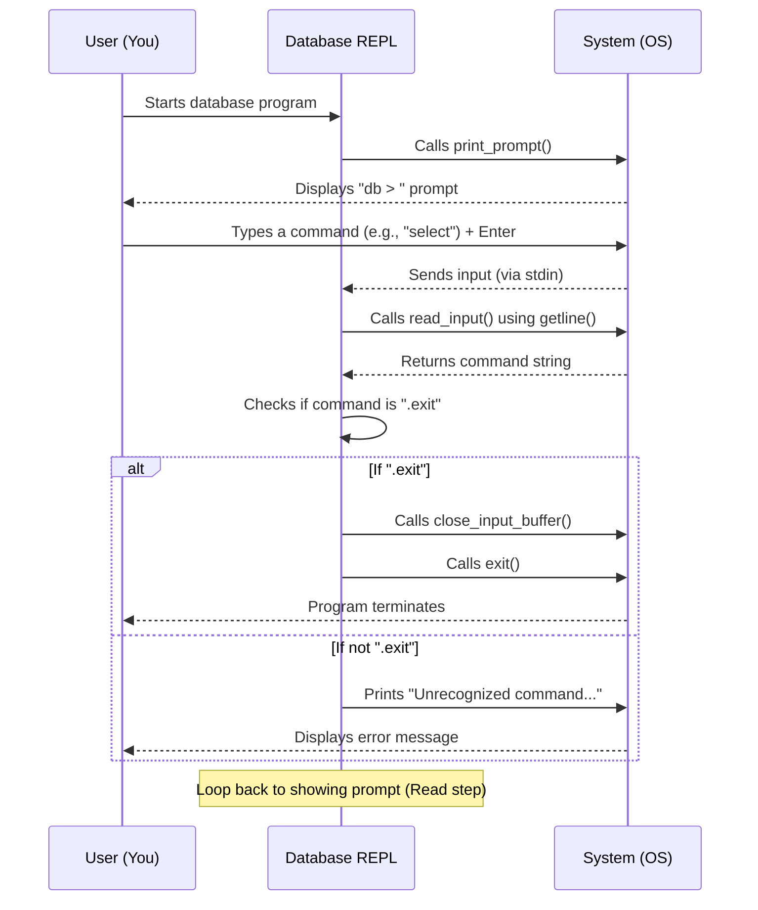

# Chapter 1: REPL (Read-Execute-Print Loop)

Imagine you're using a simple calculator. You type `2 + 2`, press Enter, and it immediately shows `4`. You then type `5 * 3`, press Enter, and it shows `15`. This continuous back-and-forth conversation, where you input something, the calculator processes it, shows you the result, and then waits for your next input, is a powerful way to interact with a system.

Our database works very similarly! Instead of numbers and math operations, you'll be typing commands to store, retrieve, or manage your data. This interactive way of talking to our database is handled by something called a **REPL**.

## What is a REPL?

REPL stands for **R**ead-**E**xecute-**P**rint **L**oop. It's the command-line interface where you, the user, directly communicate with the database. Let's break down each part:

*   **Read**: The REPL waits for you to type a command (like `insert` to add data or `select` to view it) and then reads what you've typed.
*   **Execute**: Once it has your command, the REPL processes it. It figures out what you want to do and performs the necessary actions within the database.
*   **Print**: After executing the command, the REPL displays the result back to you, such as the data you requested or a confirmation message.
*   **Loop**: After printing the result, the REPL automatically loops back to the "Read" step, waiting for your next command. This creates a continuous, conversational flow.

This interactive loop is the primary way users will interact with our database, right from their terminal!

## Building Our First REPL

Let's start by creating the basic structure of our REPL. This involves an infinite loop that constantly asks for input, reads it, and then responds. For now, our database will only understand one command: `.exit`, which will let us gracefully quit the program. Any other command will just result in an "Unrecognized command" message.

Here's how this basic interaction will look:

```shell
db > hello world
Unrecognized command 'hello world'.
db > .exit
```

To achieve this, we'll need a few pieces of code.

### The Main Loop

Our database program will start by initializing some resources and then entering an endless loop.

```c
// File: db.c
int main(int argc, char* argv[]) {
  // 1. Prepare to read input
  InputBuffer* input_buffer = new_input_buffer();

  // 2. Start the infinite loop
  while (true) {
    print_prompt();          // Show "db > "
    read_input(input_buffer); // Read what user types

    // Handle commands (for now, only .exit)
    if (strcmp(input_buffer->buffer, ".exit") == 0) {
      close_input_buffer(input_buffer); // Clean up
      exit(EXIT_SUCCESS);               // Exit program
    } else {
      printf("Unrecognized command '%s'.\n", input_buffer->buffer);
    }
  }
}
```
This `main` function (from `db.c`) sets up the heart of our REPL. It calls `print_prompt` to display the "db > " message, then `read_input` to get your command. Finally, it checks if you typed `.exit` to quit. If not, it just prints an error.

### Managing Input with `InputBuffer`

To handle the user's input, we'll use a simple helper structure called `InputBuffer`. It helps us keep track of the text the user types and how much memory we've allocated for it.

```c
// File: db.c
typedef struct {
  char* buffer;        // Where the input string is stored
  size_t buffer_length; // Total memory allocated for buffer
  ssize_t input_length; // Actual length of the input received
} InputBuffer;

InputBuffer* new_input_buffer() {
  InputBuffer* input_buffer = malloc(sizeof(InputBuffer));
  input_buffer->buffer = NULL; // Initially no memory allocated
  input_buffer->buffer_length = 0;
  input_buffer->input_length = 0;
  return input_buffer;
}
```
The `InputBuffer` struct simply holds information about the input string. `new_input_buffer` allocates memory for this structure and initializes its fields.

### Showing the Prompt

Before we read any input, we need to show the user that our database is ready to receive commands. This is done by printing a simple prompt like `db > `.

```c
// File: db.c
void print_prompt() {
  printf("db > ");
}
```
This function is straightforward; it just prints our prompt to the terminal.

### Reading User Input

To read a full line of text typed by the user, we'll use a standard C library function called `getline()`. This function is very convenient because it can automatically allocate enough memory to hold whatever the user types, no matter how long.

```c
// File: db.c
void read_input(InputBuffer* input_buffer) {
  // getline reads a line from stdin into input_buffer->buffer
  ssize_t bytes_read =
      getline(&(input_buffer->buffer), &(input_buffer->buffer_length), stdin);

  if (bytes_read <= 0) { // Check for errors or end of input
    printf("Error reading input\n");
    exit(EXIT_FAILURE);
  }

  // Remove the trailing newline character that getline includes
  input_buffer->input_length = bytes_read - 1;
  input_buffer->buffer[bytes_read - 1] = 0;
}
```
`read_input` is where the magic happens. `getline` takes a pointer to our `buffer` (where the text will go), a pointer to `buffer_length` (which `getline` will update with the allocated size), and `stdin` (meaning we're reading from the standard input, usually your keyboard). We also handle potential errors and remove the newline character (`\n`) that `getline` adds at the end of the input.

### Cleaning Up

Whenever we allocate memory (like we do for `InputBuffer` and its `buffer`), it's good practice to free that memory when we're done with it to prevent memory leaks.

```c
// File: db.c
void close_input_buffer(InputBuffer* input_buffer) {
    free(input_buffer->buffer); // Free the string buffer
    free(input_buffer);         // Free the InputBuffer struct itself
}
```
This function is called right before our program exits, making sure we leave no memory behind.

## How the REPL Works (Behind the Scenes)

Let's visualize the flow of our simple REPL:



As you can see, the REPL continuously cycles through reading your command, performing a very basic check, and then printing a message, before looping back to wait for your next input. It's a fundamental pattern for interactive programs.

## Conclusion

In this chapter, we've set up the very first piece of our database: the **REPL**. You now understand how this simple but powerful loop allows users to interact with the database by continuously reading commands, executing them, printing results, and repeating the process. It's like having a constant conversation with your database!

Currently, our database can only understand a single command (`.exit`), but in the next chapter, we'll start learning about how data is organized, specifically focusing on [Row & Serialization](02_row___serialization_.md) – how our database will actually store and retrieve information.
