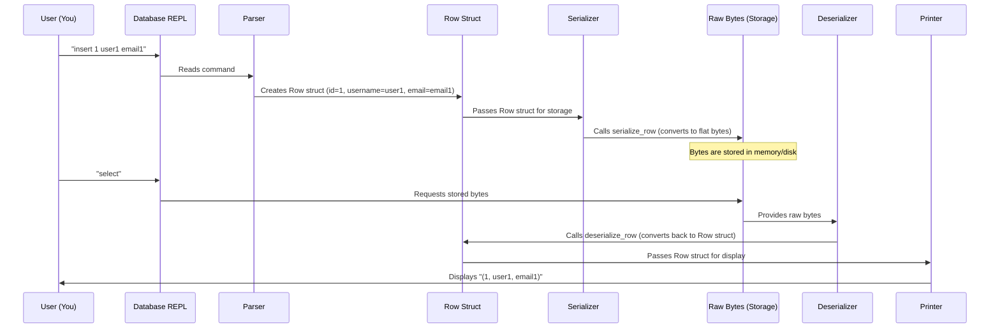

# Chapter 2: Row & Serialization

In the last chapter, [Chapter 1: REPL (Read-Execute-Print Loop)](01_repl__read_execute_print_loop__.md), we built the interactive part of our database, the REPL. You can now type commands like `.exit` and get a response. But what's the point of a database if you can't actually store any data?

That's exactly the problem we'll tackle in this chapter! Our goal is to understand how our database will hold onto the information you give it. We need a way to store structured data, like details about a user, and then retrieve it later.

Imagine you want to store information about your friends: their ID number, their name, and their email address. How would a database keep track of this? It needs a standardized way to represent each friend's details.

## What is a Row?

In a database, a single record of information is called a **Row**. Think of it like a single entry in a spreadsheet. Each row contains different pieces of information, called "columns" or "fields", that describe one item.

For our simple database, we'll start with a hard-coded table to store users, and each user will have three main pieces of data:

| Column   | Type         | Description                  |
|----------|--------------|------------------------------|
| `id`       | Integer      | A unique number for the user |
| `username` | Text (32 chars) | The user's chosen name       |
| `email`    | Text (255 chars) | The user's email address     |

In our C code, we'll represent this `Row` as a `struct`:

```c
// File: db.c
#define COLUMN_USERNAME_SIZE 32
#define COLUMN_EMAIL_SIZE 255

typedef struct {
  uint32_t id;
  char username[COLUMN_USERNAME_SIZE + 1]; // +1 for null terminator
  char email[COLUMN_EMAIL_SIZE + 1];     // +1 for null terminator
} Row;
```

Here:
*   `uint32_t id`: `uint32_t` means an unsigned integer that takes up 32 bits (4 bytes) of memory. It's great for unique IDs.
*   `char username[COLUMN_USERNAME_SIZE + 1]`: This is an array of characters, which is how we store text (strings) in C. We add `+ 1` to `COLUMN_USERNAME_SIZE` (32) and `COLUMN_EMAIL_SIZE` (255) because C strings need an extra byte at the end (a 'null terminator', represented by `\0`) to mark where the string ends. This was an important bug fix discovered during testing!

## Why Serialization?

Now that we have a `Row` struct, why can't we just save it directly to a file or memory?

The problem is that a C `struct` is designed for your program to use. The way it's laid out in memory might include hidden "padding" bytes added by the compiler to make things faster, or the order of fields could even change depending on your computer's architecture. If we just saved these raw structs, another program (or even the same program on a different computer) might not be able to read them correctly!

Think of it like packing a suitcase:

*   **`Row` Struct (Unpacked)**: Your clothes are folded nicely, but maybe there's some empty space, and the exact arrangement might vary each time you pack. It's convenient for you *inside* the house.
*   **Storage (Packed)**: For travel, you want your suitcase compact and organized in a predictable way so it fits in the overhead bin. The goal is to maximize space and ensure everything is in its expected place when you unpack.

This "packing" process for our `Row` data is called **serialization**. It's the process of converting our structured `Row` data into a flat, compact sequence of bytes. The reverse process, "unpacking" these bytes back into a usable `Row` structure, is called **deserialization**.

## How to Serialize and Deserialize a Row

To achieve a compact and predictable representation, we'll define a strict layout for our serialized rows. Each column will always take up a specific amount of space and be at a specific "offset" (distance from the start) within the row's bytes.

We define these sizes and offsets as constants in our code:

```c
// File: db.c
// ... inside db.c, after Row struct ...

// A clever way to get the size of a struct's member without needing an actual struct instance.
#define size_of_attribute(Struct, Attribute) sizeof(((Struct*)0)->Attribute)

const uint32_t ID_SIZE = size_of_attribute(Row, id);
const uint32_t USERNAME_SIZE = size_of_attribute(Row, username);
const uint32_t EMAIL_SIZE = size_of_attribute(Row, email);

const uint32_t ID_OFFSET = 0; // ID starts at the very beginning
const uint32_t USERNAME_OFFSET = ID_OFFSET + ID_SIZE; // Username starts after ID
const uint32_t EMAIL_OFFSET = USERNAME_OFFSET + USERNAME_SIZE; // Email starts after Username

const uint32_t ROW_SIZE = ID_SIZE + USERNAME_SIZE + EMAIL_SIZE; // Total size of a serialized row
```

This means the layout of a serialized row will always look exactly like this:

| Column   | Size (bytes) | Offset (bytes from start) |
|----------|--------------|---------------------------|
| `id`       | 4            | 0                         |
| `username` | 32           | 4                         |
| `email`    | 255          | 36                        |
| **Total**| **291**      |                           |

Now, let's write the functions to perform the packing and unpacking:

```c
// File: db.c
void serialize_row(Row* source, void* destination) {
  // Copy ID from source Row to destination bytes, starting at ID_OFFSET
  memcpy(destination + ID_OFFSET, &(source->id), ID_SIZE);
  // Copy Username from source Row to destination bytes, starting at USERNAME_OFFSET
  memcpy(destination + USERNAME_OFFSET, &(source->username), USERNAME_SIZE);
  // Copy Email from source Row to destination bytes, starting at EMAIL_OFFSET
  memcpy(destination + EMAIL_OFFSET, &(source->email), EMAIL_SIZE);
}
```

The `memcpy` function is a standard C library function that simply copies a specified number of bytes from one memory location (`source`) to another (`destination`). We use it to carefully place each part of our `Row` struct into its designated spot in the `destination` byte array.

And the reverse:

```c
// File: db.c
void deserialize_row(void* source, Row* destination) {
  // Copy ID from source bytes to destination Row, starting at ID_OFFSET
  memcpy(&(destination->id), source + ID_OFFSET, ID_SIZE);
  // Copy Username from source bytes to destination Row, starting at USERNAME_OFFSET
  memcpy(&(destination->username), source + USERNAME_OFFSET, USERNAME_SIZE);
  // Copy Email from source bytes to destination Row, starting at EMAIL_OFFSET
  memcpy(&(destination->email), source + EMAIL_OFFSET, EMAIL_SIZE);
}
```

This function does the opposite: it takes the raw bytes from `source` and copies them back into the structured `Row` format at `destination`, making the data easily accessible to our C program.

## How Row & Serialization Solve Our Use Case

Let's see how `Row` and `Serialization` fit into our database's operations:

1.  **Inserting a Row (`insert` command)**:
    *   When you type `insert 1 cstack foo@bar.com`, our REPL (from [Chapter 1: REPL (Read-Execute-Print Loop)](01_repl__read_execute_print_loop__.md)) reads this command.
    *   It then parses the `id`, `username`, and `email` from your input.
    *   These pieces of data are assembled into a `Row` struct in memory.
    *   Finally, the `serialize_row` function is called to convert this `Row` struct into a compact sequence of bytes. These bytes are then ready to be stored in our database's memory.

2.  **Selecting Rows (`select` command)**:
    *   When you type `select`, our database looks for the stored byte sequences.
    *   For each sequence, it calls `deserialize_row` to convert the raw bytes back into a `Row` struct.
    *   Once in `Row` struct format, the data is easy to read and `print_row` can display it nicely on your screen.

Here's how it would look when you interact with our database:

```shell
db > insert 1 cstack foo@bar.com
Executed.
db > insert 2 bob bob@example.com
Executed.
db > select
(1, cstack, foo@bar.com)
(2, bob, bob@example.com)
Executed.
db >
```

## Internal Implementation Walkthrough

Let's visualize the journey of data when you `insert` and `select` it:



Let's dive into the code snippets that make this happen:

First, how the `insert` command is parsed into a `Row` struct:

```c
// File: db.c (part of prepare_insert function)
PrepareResult prepare_insert(InputBuffer* input_buffer, Statement* statement) {
  statement->type = STATEMENT_INSERT; // Mark as an INSERT operation

  // Use strtok to split the input string by spaces
  char* keyword = strtok(input_buffer->buffer, " ");
  char* id_string = strtok(NULL, " ");
  char* username = strtok(NULL, " ");
  char* email = strtok(NULL, " ");

  // ... error checks for NULL, string length, negative ID ...

  // Convert string ID to integer
  int id = atoi(id_string);

  // Copy parsed values into the Row struct inside the statement
  statement->row_to_insert.id = id;
  strcpy(statement->row_to_insert.username, username);
  strcpy(statement->row_to_insert.email, email);

  return PREPARE_SUCCESS;
}
```

This `prepare_insert` function takes the command line input, breaks it into pieces using `strtok`, converts the `id` to a number, and then copies the data into the `row_to_insert` field of our `Statement` struct. This `row_to_insert` is an actual `Row` struct, ready to be serialized.

Next, how `execute_insert` uses `serialize_row`:

```c
// File: db.c (part of execute_insert function)
ExecuteResult execute_insert(Statement* statement, Table* table) {
  Row* row_to_insert = &(statement->row_to_insert); // Get the Row struct from the statement

  // ... (logic to find where to store the row in the table) ...

  // Call serialize_row to convert the Row struct into flat bytes
  // row_slot(table, table->num_rows) gives us the memory address for storage
  serialize_row(row_to_insert, row_slot(table, table->num_rows));
  // Increment the count of rows in our table
  // table->num_rows += 1; // This line is missing from the provided context code, but conceptually happens here

  return EXECUTE_SUCCESS;
}
```

Here, the `execute_insert` function gets the `Row` struct that was prepared, then calls `serialize_row` to pack it into a compact byte format. The `row_slot` function (which we'll explore in future chapters like [Chapter 6: Pager](06_pager_.md)) gives us the exact memory location where these bytes should be stored.

Finally, how `execute_select` uses `deserialize_row` and `print_row`:

```c
// File: db.c (part of execute_select function)
void print_row(Row* row) {
  printf("(%d, %s, %s)\n", row->id, row->username, row->email);
}

ExecuteResult execute_select(Statement* statement, Table* table) {
  // ... (logic to iterate through rows in the table) ...
  Row row; // Create an empty Row struct to hold the deserialized data

  // Loop through all stored rows
  // (Cursor iteration logic omitted for brevity, will be covered in Chapter 4)
  // For each stored row:
  // void* row_data = /* get raw bytes from storage */; // Conceptually, get bytes
  deserialize_row(cursor_value(cursor), &row); // Unpack raw bytes into our Row struct
  print_row(&row); // Display the structured row

  // ... (advance cursor to next row) ...
  return EXECUTE_SUCCESS;
}
```

The `execute_select` function retrieves the raw byte data from storage (using `cursor_value` which works with the `Pager` and `Cursor` abstractions later). It then uses `deserialize_row` to convert these bytes back into a convenient `Row` struct, which is then passed to `print_row` for displaying to the user.

## Conclusion

In this chapter, we've introduced the crucial concepts of a **Row** as the fundamental unit of data and **Serialization** (and deserialization) as the process of converting structured `Row` data into a flat sequence of bytes for efficient storage, and back again for use by the application. You now understand how our database transforms your human-readable inputs into a compact form that can be saved.

While we now know how to represent and convert our data, we still need a way to actually *store* these bytes in our database's memory or on disk. That's where the next few chapters come in! Next, we'll look at [Statement Processing (Compiler & Virtual Machine)](03_statement_processing__compiler___virtual_machine__.md), where we'll explore how our database's "brain" processes your commands beyond just `.exit` and how it interacts with these `Row` and serialization concepts.
