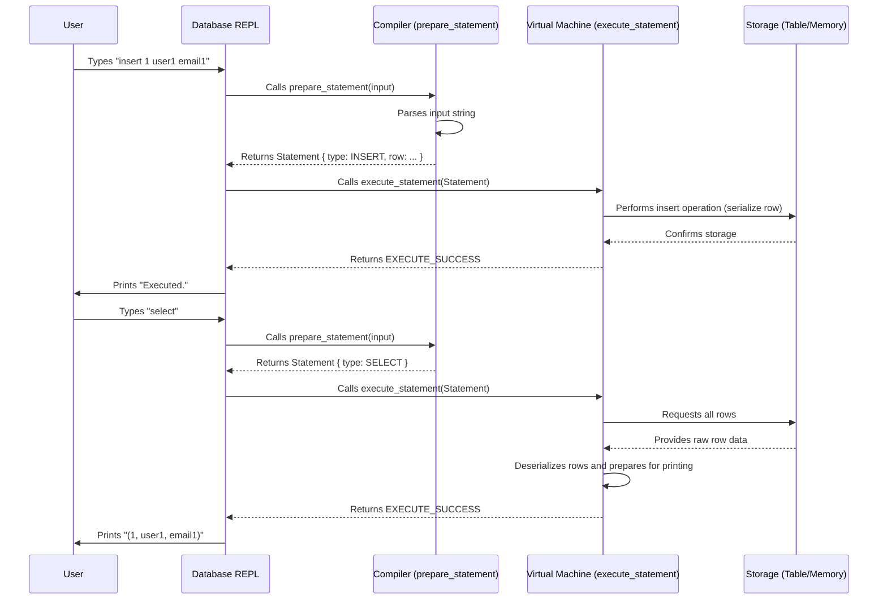

# Chapter 3: Statement Processing (Compiler & Virtual Machine)

In our journey to build a database, we've already set up the interactive part, the [Chapter 1: REPL (Read-Execute-Print Loop)](01_repl__read_execute_print_loop__.md), which lets you type commands. We also learned how to organize our data into `Row`s and pack them into compact bytes using [Chapter 2: Row & Serialization](02_row___serialization_.md). But how does our database actually *understand* what you type? How does it go from a simple text command like `insert 1 user1 email1` to actually storing that `Row`?

This is where **Statement Processing** comes in! It's like the "brain" of our database, responsible for figuring out what you want to do and then making it happen.

## What Problem Does Statement Processing Solve?

Imagine you're trying to give instructions to a robot. If you just shout "PUT IT THERE!", the robot won't know what "it" is or where "there" is. You need to give clear, structured instructions: "Take *this box* and place it *on that shelf*."

Our database faces a similar challenge. You type a raw text command, like:

```text
insert 1 cstack foo@bar.com
```

This is just a string of characters. The database needs to:
1.  **Understand** that you want to "insert" data.
2.  **Extract** the specific pieces of information: the ID (1), the username (cstack), and the email (foo@bar.com).
3.  **Perform** the actual steps to add this data to its storage.

Statement Processing handles all these steps by breaking the work into two main parts:

*   **The Compiler**: This part is like a translator. It reads your raw text command and converts it into a structured, internal instruction that the database can easily understand.
*   **The Virtual Machine**: This part is like a worker. It takes the structured instruction from the compiler and performs the actual operations (like storing data or retrieving it).

## Key Concepts

Let's look at these two parts in more detail:

### 1. The Compiler (`prepare_statement`)

Our database's "compiler" is implemented by a function called `prepare_statement`. Its job is to take your input string (like `"insert 1 cstack foo@bar.com"`) and "compile" it into a special object called a `Statement`.

Think of it this way:

*   **You speak English (your text command)**: `insert 1 cstack foo@bar.com`
*   **The Compiler translates it into "Database Action Language"**: `Statement { type: INSERT, data: {id: 1, username: "cstack", email: "foo@bar.com"} }`

This `Statement` object is much easier for the database to work with because it's already organized.

Here's the basic structure of our `Statement` object and the types of commands it can represent:

```c
// File: db.c
typedef enum { STATEMENT_INSERT, STATEMENT_SELECT } StatementType;

typedef struct {
  StatementType type;
  Row row_to_insert;  // Only used when `type` is STATEMENT_INSERT
} Statement;
```

*   `StatementType`: This `enum` (short for enumeration) defines the *kind* of command. For now, we only support `INSERT` (to add data) and `SELECT` (to view data).
*   `row_to_insert`: If the command is an `INSERT`, this field holds the actual `Row` data (ID, username, email) that we want to put into the database. This `Row` struct is exactly what we defined and learned about in [Chapter 2: Row & Serialization](02_row___serialization_.md)!

### 2. The Virtual Machine (`execute_statement`)

Our database's "virtual machine" is implemented by a function called `execute_statement`. Its role is to take the structured `Statement` object (prepared by the compiler) and carry out the actual database operations.

Once `execute_statement` receives a `Statement`, it looks at the `type` field to know what to do:

*   If `type` is `STATEMENT_INSERT`, it calls a helper function (like `execute_insert`) that handles storing the `row_to_insert` into our database.
*   If `type` is `STATEMENT_SELECT`, it calls another helper function (like `execute_select`) that handles retrieving all stored `Row`s and displaying them.

By separating the "understanding" (compiler) from the "doing" (virtual machine), our database becomes more organized and easier to build and improve.

## How Statement Processing Solves Our Use Case

Let's trace how a command like `insert 1 cstack foo@bar.com` or `select` moves through our database's new brain:

1.  **You type a command** (e.g., `insert 1 cstack foo@bar.com`) into the REPL.
2.  The REPL's `read_input` function reads your command.
3.  The main program then calls `prepare_statement` (the Compiler).
    *   `prepare_statement` looks at your string, realizes it starts with "insert", and parses out the ID, username, and email.
    *   It then creates a `Statement` object: `Statement { type: STATEMENT_INSERT, row_to_insert: {id: 1, username: "cstack", email: "foo@bar.com"} }`.
    *   It returns this `Statement` object.
4.  Next, the main program calls `execute_statement` (the Virtual Machine), passing it the `Statement` object.
    *   `execute_statement` sees that the `Statement.type` is `STATEMENT_INSERT`.
    *   It then calls the `execute_insert` helper.
    *   `execute_insert` takes the `Row` from `statement.row_to_insert`, uses `serialize_row` (from Chapter 2) to pack it into bytes, and stores these bytes in the database's memory.
5.  Finally, the REPL prints "Executed." and waits for your next command.

If you then type `select`:

1.  The REPL reads `select`.
2.  `prepare_statement` recognizes "select" and creates `Statement { type: STATEMENT_SELECT }`.
3.  `execute_statement` receives this, sees `STATEMENT_SELECT`, and calls `execute_select`.
4.  `execute_select` retrieves all stored byte sequences, uses `deserialize_row` (from Chapter 2) to unpack them back into `Row` structs, and then `print_row` (also from Chapter 2) displays them on your screen.

Here's how this looks in action:

```shell
db > insert 1 cstack foo@bar.com
Executed.
db > select
(1, cstack, foo@bar.com)
Executed.
db >
```

## Internal Implementation Walkthrough

Let's visualize the flow of commands through our new "compiler" and "virtual machine" parts:



### Changes in `main` Loop

Our `main` function (the heart of the REPL) now orchestrates this process. It used to just check for `.exit`, but now it passes all other commands through the compiler and virtual machine.

Here's how the `main` loop is updated:

```c
// File: db.c
int main(int argc, char* argv[]) {
  // ... (Initialization for input_buffer and table) ...

  while (true) {
    print_prompt();
    read_input(input_buffer);

    if (input_buffer->buffer[0] == '.') {
      // Handle "meta-commands" like .exit directly
      // (This is done by do_meta_command function)
      // ... (code omitted for brevity) ...
      continue; // Go back to prompt if it was a meta-command
    }

    Statement statement; // Declare a Statement object
    PrepareResult prepare_result = prepare_statement(input_buffer, &statement);

    switch (prepare_result) {
      case PREPARE_SUCCESS:
        break; // Statement prepared successfully
      case PREPARE_SYNTAX_ERROR:
        printf("Syntax error. Could not parse statement.\n");
        continue;
      // ... (other error cases omitted) ...
      case PREPARE_UNRECOGNIZED_STATEMENT:
        printf("Unrecognized keyword at start of '%s'.\n", input_buffer->buffer);
        continue;
    }

    ExecuteResult execute_result = execute_statement(&statement, table);

    switch (execute_result) {
      case EXECUTE_SUCCESS:
        printf("Executed.\n");
        break;
      // ... (other error cases like EXECUTE_DUPLICATE_KEY omitted) ...
    }
  }
  // ... (Cleanup for input_buffer and table) ...
}
```

As you can see, the `main` loop first checks for special "meta-commands" (like `.exit`), which are handled by `do_meta_command`. For all other commands, it calls `prepare_statement` to get a `Statement` object. If successful, it then calls `execute_statement` to run the command. Both functions return a `Result` enum, which tells `main` if the operation succeeded or if there was an error.

Here are the result `enum`s we use for clarity and error handling:

| Enum Type           | Possible Results                         | Description                                     |
|---------------------|------------------------------------------|-------------------------------------------------|
| `MetaCommandResult` | `META_COMMAND_SUCCESS`, `META_COMMAND_UNRECOGNIZED_COMMAND` | Result of handling meta-commands.               |
| `PrepareResult`     | `PREPARE_SUCCESS`, `PREPARE_SYNTAX_ERROR`, `PREPARE_NEGATIVE_ID`, `PREPARE_STRING_TOO_LONG`, `PREPARE_UNRECOGNIZED_STATEMENT` | Result of compiling/parsing the input statement. |
| `ExecuteResult`     | `EXECUTE_SUCCESS`, `EXECUTE_DUPLICATE_KEY` | Result of executing the prepared statement.     |

### The Compiler in Detail (`prepare_statement`)

The `prepare_statement` function is responsible for parsing your text. It uses C functions like `strncmp` (to check if the string *starts* with a keyword like "insert") and `strtok` (to break the string into pieces by spaces).

Let's look at `prepare_insert` which handles the "insert" command:

```c
// File: db.c
PrepareResult prepare_insert(InputBuffer* input_buffer, Statement* statement) {
  statement->type = STATEMENT_INSERT; // Set statement type

  // strtok breaks the input string into "tokens" based on spaces
  char* keyword = strtok(input_buffer->buffer, " "); // "insert"
  char* id_string = strtok(NULL, " ");              // "1"
  char* username = strtok(NULL, " ");               // "cstack"
  char* email = strtok(NULL, " ");                  // "foo@bar.com"

  // Basic error checks: are all parts present?
  if (id_string == NULL || username == NULL || email == NULL) {
    return PREPARE_SYNTAX_ERROR;
  }

  int id = atoi(id_string); // Convert ID string to integer
  if (id < 0) {
    return PREPARE_NEGATIVE_ID; // ID cannot be negative
  }
  // Check if username/email are too long (from COLUMN_USERNAME_SIZE in Chapter 2)
  if (strlen(username) > COLUMN_USERNAME_SIZE || strlen(email) > COLUMN_EMAIL_SIZE) {
    return PREPARE_STRING_TOO_LONG;
  }

  // Copy parsed values into the Row struct within the statement
  statement->row_to_insert.id = id;
  strcpy(statement->row_to_insert.username, username);
  strcpy(statement->row_to_insert.email, email);

  return PREPARE_SUCCESS;
}

// And the main prepare_statement function dispatches to prepare_insert
PrepareResult prepare_statement(InputBuffer* input_buffer, Statement* statement) {
  if (strncmp(input_buffer->buffer, "insert", 6) == 0) {
    return prepare_insert(input_buffer, statement); // Call helper for insert
  }
  if (strcmp(input_buffer->buffer, "select") == 0) {
    statement->type = STATEMENT_SELECT; // Just set type for select
    return PREPARE_SUCCESS;
  }
  return PREPARE_UNRECOGNIZED_STATEMENT; // For anything else
}
```
This `prepare_insert` function is quite busy! It takes the raw input, carves out the different pieces (ID, username, email), does some basic checks (like ensuring the ID isn't negative or strings aren't too long), and then carefully places these parsed values into the `row_to_insert` field of the `Statement` struct. The `prepare_statement` function acts as a dispatcher, checking the beginning of the command and sending it to the right helper.

### The Virtual Machine in Detail (`execute_statement`)

The `execute_statement` function is simpler; it just decides which operation to perform based on the `StatementType`:

```c
// File: db.c
ExecuteResult execute_statement(Statement* statement, Table* table) {
  switch (statement->type) {
    case (STATEMENT_INSERT):
      return execute_insert(statement, table); // Call insert handler
    case (STATEMENT_SELECT):
      return execute_select(statement, table); // Call select handler
  }
  // This part of the code should technically be unreachable if all statement types are handled
  // For safety, you might add a default case or an assertion here.
}
```

And here's a simplified view of the functions it calls:

```c
// File: db.c
ExecuteResult execute_insert(Statement* statement, Table* table) {
  Row* row_to_insert = &(statement->row_to_insert); // Get the Row struct

  // ... (Logic to check for duplicate keys, find storage location) ...

  // Call serialize_row from Chapter 2 to pack Row into bytes
  // cursor manages where the row will be stored
  serialize_row(row_to_insert, cursor_value(cursor));
  // ... (Logic to advance cursor or update table's row count) ...

  return EXECUTE_SUCCESS;
}

ExecuteResult execute_select(Statement* statement, Table* table) {
  // ... (Logic to start a cursor for iterating through rows) ...
  Row row; // Temporary Row struct for deserialized data

  while (!(cursor->end_of_table)) { // Loop until all rows are read
    // Call deserialize_row from Chapter 2 to unpack bytes into Row struct
    deserialize_row(cursor_value(cursor), &row);
    print_row(&row); // Print the Row (function from Chapter 2)
    // ... (Logic to advance the cursor to the next row) ...
  }

  return EXECUTE_SUCCESS;
}
```
The `execute_insert` and `execute_select` functions show how our "virtual machine" uses the `Row` and serialization concepts from Chapter 2. When inserting, it takes the prepared `Row` and `serialize_row`s it into storage. When selecting, it retrieves the raw bytes, `deserialize_row`s them, and then `print_row`s the nicely formatted data. The `cursor` and `table` details are simplified here, as they will be explored in future chapters.

## Conclusion

In this chapter, we've built the crucial "brain" of our database: the **Statement Processor**. You've learned how the "compiler" (`prepare_statement`) acts like a translator, turning your raw commands into structured `Statement` objects, and how the "virtual machine" (`execute_statement`) then takes these structured instructions and performs the actual database operations. This separation makes our database robust and organized.

While our database can now understand and perform basic `insert` and `select` commands, it still doesn't have a smart way to find specific data quickly or manage its storage efficiently. That's what we'll tackle next, by diving into the concept of a [Chapter 4: Cursor](04_cursor_.md), which helps us navigate through our data.
