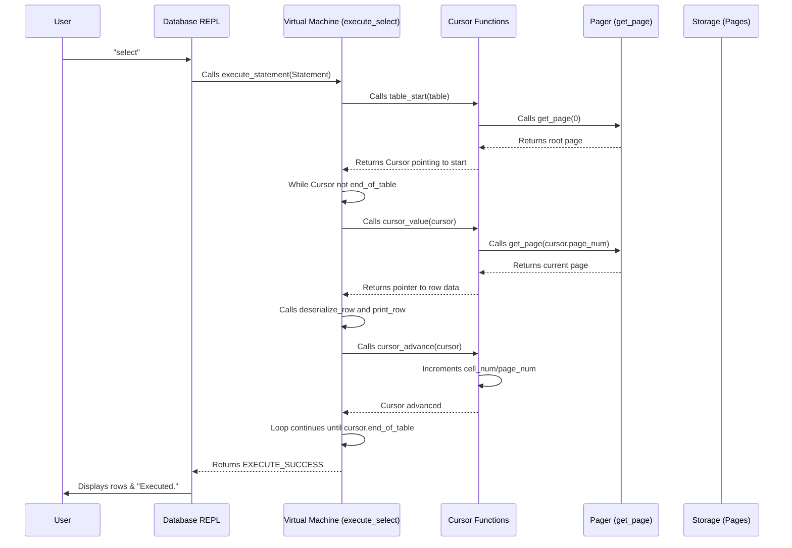

# Chapter 4: Cursor

In our database journey, we've built the interactive [Chapter 1: REPL (Read-Execute-Print Loop)](01_repl__read_execute_print_loop__.md) and learned how to structure our data into `Row`s and efficiently store them as bytes using [Chapter 2: Row & Serialization](02_row___serialization_.md). We then gave our database a "brain" in [Chapter 3: Statement Processing (Compiler & Virtual Machine)](03_statement_processing__compiler___virtual_machine__.md) to understand commands like `insert` and `select`.

But there's a missing piece! Imagine you have a massive book, and you want to find a specific sentence or read from a certain page. You wouldn't just tell someone "read the 500th letter from the beginning." Instead, you'd say, "Go to page 10, find the third paragraph, and start reading there." You're using a *pointer* to a specific location without knowing the exact physical position in the book's binding.

Our database faces a similar challenge. Currently, when we want to `select` all rows, our code just loops through a simple array of rows, assuming they are stored one after another, perfectly indexed from 0 to `num_rows - 1`. This works for a very simple, in-memory table. But what if our data isn't stored in a simple, sequential list? What if it's organized in a more complex, efficient structure like a tree (which we'll explore in the next chapter!) where records are scattered across many "pages"? Directly asking for "row number 5" might not make sense if the data isn't just in a sequential list.

This is where a **Cursor** comes in!

## What Problem Does a Cursor Solve?

The `Cursor` is an essential abstraction that helps us **navigate and interact with data in our database's storage structure without needing to know the complex details of how that data is physically arranged.**

Think of a `Cursor` as an abstract "finger" or "pointer" that always points to a specific record (or a potential location for a record) within our database. Instead of calculating exact memory addresses or page numbers ourselves, we can use the cursor to:

*   Go to the **beginning** of the table.
*   Find the **exact spot** where a new record should be inserted (or check if it already exists).
*   **Read** the record currently pointed to.
*   **Move** to the next record.

This simplifies our code greatly because the `execute_insert` and `execute_select` functions no longer need to worry about the low-level details of page numbers or memory offsets. They just ask the `Cursor` to do the navigating!

## Key Concepts of a Cursor

Our `Cursor` will be a simple `struct` that holds enough information to identify a unique location in our database's storage.

```c
// File: db.c
typedef struct {
  Table* table;      // A reference to the table the cursor belongs to
  uint32_t page_num; // The page number where the row is located
  uint32_t cell_num; // The 'slot' or 'cell' number on that page
  bool end_of_table; // True if the cursor is positioned one past the last element
} Cursor;
```

Let's break down its parts:

*   **`Table* table`**: A pointer back to the `Table` itself. This allows cursor functions to easily access the table's `Pager` to retrieve pages.
*   **`uint32_t page_num`**: In a real database, data is stored in fixed-size blocks called "pages" (we'll learn more about these in [Chapter 6: Pager](06_pager_.md)). This tells us *which page* our record is on.
*   **`uint32_t cell_num`**: Each page can hold multiple records. This tells us *which record* (or "cell") on that specific page our cursor is pointing to.
*   **`bool end_of_table`**: This is a flag to indicate if the cursor is pointing "beyond" the last valid record. This is useful for loops that iterate through all records, so they know when to stop. It also helps for inserting new records at the very end.

Now let's look at the core functions that operate on a `Cursor`:

### 1. `table_start(Table* table)`: Getting a Cursor at the Beginning

This function gives us a `Cursor` that points to the very first record in our table.

```c
// File: db.c
Cursor* table_start(Table* table) {
  Cursor* cursor = malloc(sizeof(Cursor));
  cursor->table = table;
  cursor->page_num = 0; // Assume first page for simplicity now
  cursor->cell_num = 0; // Assume first cell for simplicity now
  
  // Logic to determine if table is empty (will be more complex with B-Trees)
  void* node = get_page(table->pager, cursor->page_num);
  cursor->end_of_table = (*leaf_node_num_cells(node) == 0);

  return cursor;
}
```
This function allocates memory for a new `Cursor`, links it to the `table`, and initially points it to the first page and first cell. It also sets `end_of_table` if there are no records in the table.

### 2. `table_find(Table* table, uint32_t key)`: Finding a Specific Location

This is a powerful function that will eventually perform a search (like a binary search on a B-Tree) to find the exact location of a `key` (like a user's ID) in our database. If the key exists, the cursor will point to it. If not, the cursor will point to the location *where that key should be inserted* to maintain sorted order.

```c
// File: db.c
Cursor* table_find(Table* table, uint32_t key) {
  uint32_t root_page_num = table->root_page_num;
  void* root_node = get_page(table->pager, root_page_num);

  // For now, we'll simplify and say it finds it in the "root leaf node".
  // Later, this function will traverse B-Tree internal nodes.
  // It uses binary search on a leaf node to find the right cell_num.
  return leaf_node_find(table, root_page_num, key);
}
```
`table_find` will become very smart. For this chapter, just know that it intelligently figures out *where* a key should go, which is critical for `insert` operations to keep data organized and avoid duplicates.

### 3. `cursor_value(Cursor* cursor)`: Accessing the Current Record

Once a cursor is pointing to a record, `cursor_value` gives us a memory address (a `void*`) where the serialized `Row` data is stored. This allows us to `deserialize_row` the data and work with it.

```c
// File: db.c
void* cursor_value(Cursor* cursor) {
  uint32_t page_num = cursor->page_num;
  void* page = get_page(cursor->table->pager, page_num);

  // Calculate the offset on the page to find the specific row's data
  // This uses ROW_SIZE from Chapter 2
  // And LEAF_NODE_HEADER_SIZE and LEAF_NODE_CELL_SIZE (details for Chapter 5)
  return leaf_node_value(page, cursor->cell_num);
}
```
This function is the bridge between the abstract `Cursor` and the actual bytes stored in memory. It uses the `page_num` and `cell_num` to calculate the exact spot on the page where the serialized row is.

### 4. `cursor_advance(Cursor* cursor)`: Moving to the Next Record

This function moves the cursor to the *next* record in the table. This is crucial for `select` operations, allowing us to read all records one by one.

```c
// File: db.c
void cursor_advance(Cursor* cursor) {
  uint32_t page_num = cursor->page_num;
  void* node = get_page(cursor->table->pager, page_num);

  cursor->cell_num += 1; // Move to the next cell on the current page

  // If we moved past the last cell on this page:
  if (cursor->cell_num >= (*leaf_node_num_cells(node))) {
    // Check if there's a "next leaf node" (for B-Trees, a sibling page)
    uint32_t next_page_num = *leaf_node_next_leaf(node);
    if (next_page_num == 0) { // If 0, there is no next leaf node (we are at the end)
      cursor->end_of_table = true;
    } else { // Move to the next page and reset cell_num to 0
      cursor->page_num = next_page_num;
      cursor->cell_num = 0;
    }
  }
}
```
`cursor_advance` increments the `cell_num`. If it goes past the end of the current page, it then checks for the next page in the storage structure and moves the `cursor` there, resetting `cell_num` to 0. If there are no more pages, it sets `end_of_table` to `true`.

## How Cursor Solves Our Use Case

Let's see how `insert` and `select` commands now use the `Cursor` abstraction to interact with the data, making them more robust for future, complex storage structures.

### Inserting a Row (`insert` command)

1.  **Find Insertion Point**: When you type `insert 1 cstack foo@bar.com`, the database no longer just puts it at the "end". Instead, it uses `table_find(table, id)` to get a `Cursor` pointing to the exact cell where `id=1` should go (maintaining sorted order). This also allows checking for duplicate keys.
2.  **Write Data**: Using the `Cursor`'s location (via `cursor_value`), the database `serialize_row`s the new `Row` into that specific memory slot.

### Selecting Rows (`select` command)

1.  **Start Cursor**: When you type `select`, the database calls `table_start(table)` to get a `Cursor` pointing to the first record.
2.  **Loop and Read**: It then enters a loop. In each iteration:
    *   It checks if `cursor->end_of_table` is `true`. If so, the loop ends.
    *   It uses `cursor_value(cursor)` to get the memory address of the current row.
    *   It `deserialize_row`s the data into a `Row` struct and `print_row`s it.
    *   It calls `cursor_advance(cursor)` to move to the next record.

Here's how this looks when you interact with our database:

```shell
db > insert 1 cstack foo@bar.com
Executed.
db > insert 3 charlie charlie@example.com
Executed.
db > insert 2 bob bob@example.com
Executed.
db > select
(1, cstack, foo@bar.com)
(2, bob, bob@example.com)
(3, charlie, charlie@example.com)
Executed.
db > insert 2 another_bob another_bob@example.com
Error: Duplicate key.
db >
```
Notice how `insert 2` was inserted in the correct sorted position, and inserting `2` again resulted in a `Duplicate key` error, all thanks to the `Cursor` logic!

## Internal Implementation Walkthrough

Let's visualize the flow of a `select` command using the new `Cursor` abstraction:



### Changes in `execute_insert`

The `execute_insert` function now uses `table_find` to get the `Cursor` for the correct insertion point. It then checks for duplicate keys *before* actually inserting the data.

```c
// File: db.c (simplified part of execute_insert)
ExecuteResult execute_insert(Statement* statement, Table* table) {
  Row* row_to_insert = &(statement->row_to_insert);
  uint32_t key_to_insert = row_to_insert->id;

  // Use table_find to get cursor where the key should be
  Cursor* cursor = table_find(table, key_to_insert);

  void* node = get_page(table->pager, cursor->page_num);
  uint32_t num_cells = *leaf_node_num_cells(node);

  // Check for duplicate key:
  // If the cursor is not beyond the last cell AND
  // the key at the cursor's position is already our key_to_insert
  if (cursor->cell_num < num_cells) {
    uint32_t key_at_index = *leaf_node_key(node, cursor->cell_num);
    if (key_at_index == key_to_insert) {
      free(cursor); // Don't forget to free the cursor!
      return EXECUTE_DUPLICATE_KEY; // Error: Key already exists
    }
  }

  // If no duplicate, proceed to insert the row using the cursor
  leaf_node_insert(cursor, row_to_insert->id, row_to_insert);

  free(cursor); // Always free the dynamically allocated cursor!
  return EXECUTE_SUCCESS;
}
```
This new `execute_insert` is much more powerful. It uses the `Cursor` to intelligently locate the correct position for the new row and, importantly, to detect and reject duplicate IDs.

### Changes in `execute_select`

The `execute_select` function is now much cleaner, relying entirely on the `Cursor` for navigation:

```c
// File: db.c (simplified part of execute_select)
ExecuteResult execute_select(Statement* statement, Table* table) {
  // Get a cursor pointing to the beginning of the table
  Cursor* cursor = table_start(table);

  Row row; // Temporary Row struct to hold deserialized data

  // Loop as long as the cursor is NOT at the end of the table
  while (!(cursor->end_of_table)) {
    // Get the memory address of the current row using the cursor
    void* row_data_ptr = cursor_value(cursor);
    // Deserialize the raw bytes into our Row struct
    deserialize_row(row_data_ptr, &row);
    // Print the nicely formatted row
    print_row(&row);
    // Advance the cursor to the next row
    cursor_advance(cursor);
  }

  free(cursor); // Don't forget to free the dynamically allocated cursor!
  return EXECUTE_SUCCESS;
}
```
This `execute_select` loop clearly shows the `Cursor` in action: initialize it, then repeatedly read and advance until the `end_of_table` is reached. This pattern is generic and will work regardless of how complex our underlying storage structure becomes.

## Conclusion

In this chapter, we introduced the **Cursor** – a powerful abstraction that acts as an abstract pointer within our database's storage. You've learned how it simplifies data interaction by hiding the complexities of physical storage locations, allowing us to `table_start`, `table_find`, `cursor_value`, and `cursor_advance` through our data. This cursor will be the key to efficiently navigating more complex data structures.

With the `Cursor` in place, we're now ready to tackle the actual sophisticated data storage structure: the [Chapter 5: B-Tree Node](05_b_tree_node_.md)!
