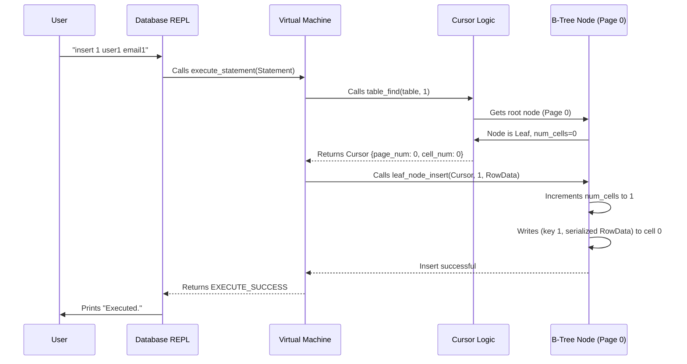

#Chapter 5 : B - Tree Node

In our database journey, we've set up an interactive way to talk to our database using the [Chapter 1: REPL (Read-Execute-Print Loop)](01_repl__read_execute_print_loop__.md). We've learned how to neatly pack our data into `Row`s using [Chapter 2: Row & Serialization](02_row___serialization_.md), and how our database understands and executes your commands with its "brain" in [Chapter 3: Statement Processing (Compiler & Virtual Machine)](03_statement_processing__compiler___virtual_machine__.md). Most recently, we introduced the [Chapter 4: Cursor](04_cursor_.md), which acts like an intelligent pointer, helping us navigate our data without needing to know every low-level detail.

However, our database still stores data in a very simple way: like a long, sequential list. Imagine if you had a library with millions of books, but they were all just stacked in one giant, unsorted pile! Finding a specific book would take forever, and adding a new book in the middle would mean moving countless others.

This is the problem our database faces as it grows. Inserting new rows, finding specific rows, or even deleting them becomes painfully slow. We need a much smarter way to organize our data.

## What Problem Does a B-Tree Node Solve?

The `B-Tree Node` is the fundamental building block of a powerful data structure called a **B-Tree** (or more specifically, a B+ Tree, which databases like SQLite use for tables). Instead of a simple flat list, a B-Tree organizes data into a balanced, tree-like structure. Each "node" in this tree is like a well-organized shelf or section in our library.

This tree-like organization allows our database to:

*   **Find data quickly:** Even with millions of rows, it can pinpoint a specific record in a handful of steps.
*   **Insert and delete efficiently:** Adding or removing data doesn't require shuffling vast amounts of other data.
*   **Keep data sorted:** Records are naturally kept in order, which is great for `SELECT` statements.

How does it achieve this? By breaking down the storage into small, manageable `B-Tree Nodes`. Each node corresponds to a single "page" (a fixed-size block of memory, usually 4KB) in our database file.

## Key Concepts of a B-Tree Node

Think of each B-Tree Node as a self-contained unit or "box" within our database.

### 1. Common Header

Every single B-Tree node, regardless of its purpose, starts with a small "header" section. This header contains essential metadata (data about the data) that tells the database important things about the node.

*   **`Node Type`**: This tells us what kind of node it is: `NODE_LEAF` or `NODE_INTERNAL`.
*   **`Is Root`**: A simple yes/no question: Is this the very first node in our entire tree structure? The "root" node is like the main entrance to our library.
*   **`Parent Pointer`**: This points to the page number of the node directly above it in the tree. It's like a path back to the section supervisor in our library, helpful for navigating up the tree when operations require it.

Here's how we define these header fields in our code:

```c
// File: db.c
typedef enum { NODE_INTERNAL, NODE_LEAF } NodeType;

/* Common Node Header Layout */
const uint32_t NODE_TYPE_SIZE = sizeof(uint8_t);
const uint32_t NODE_TYPE_OFFSET = 0;
const uint32_t IS_ROOT_SIZE = sizeof(uint8_t);
const uint32_t IS_ROOT_OFFSET = NODE_TYPE_SIZE;
const uint32_t PARENT_POINTER_SIZE = sizeof(uint32_t);
const uint32_t PARENT_POINTER_OFFSET = IS_ROOT_OFFSET + IS_ROOT_SIZE;
const uint8_t COMMON_NODE_HEADER_SIZE =
    NODE_TYPE_SIZE + IS_ROOT_SIZE + PARENT_POINTER_SIZE; // Total 6 bytes

// Functions to access these header fields:
// Example: Get the type of a node
NodeType get_node_type(void *node)
{
    uint8_t value = *((uint8_t *)(node + NODE_TYPE_OFFSET));
    return (NodeType)value;
}
// Example: Set if a node is the root
void set_node_root(void *node, bool is_root)
{
    uint8_t value = is_root;
    *((uint8_t *)(node + IS_ROOT_OFFSET)) = value;
}
// Example: Get a pointer to the parent page number
uint32_t *node_parent(void *node) { return node + PARENT_POINTER_OFFSET; }
```
These small helper functions allow us to read or write specific pieces of information in the node's header by doing a bit of pointer math.

### 2. Two Types of Nodes

B-Trees primarily use two types of nodes, each with a distinct job:

#### a) Leaf Nodes (`NODE_LEAF`)

*   **Purpose**: These are the "bottom-level" nodes in the tree. They hold the **actual `Row` data** that you insert into the database (like the `id`, `username`, and `email`).
*   **Analogy**: These are the individual bookshelves that actually contain the books you want to read.
*   **Structure**:
    *   They have the `Common Node Header`.
    *   A `num_cells` field: Tells us how many `Row`s (or "cells") are currently stored in this node.
    *   A `next_leaf` pointer: A special pointer to the *next* leaf node in sequence, allowing us to easily scan through all records from smallest ID to largest.
    *   The rest of the page is the "body", an array of `cells`. Each `cell` is a `key` (the row's `id`) followed by the serialized `Row` data (the "value").

```c
// File: db.c
/* Leaf Node Header Layout */
const uint32_t LEAF_NODE_NUM_CELLS_SIZE = sizeof(uint32_t);
const uint32_t LEAF_NODE_NUM_CELLS_OFFSET = COMMON_NODE_HEADER_SIZE;
const uint32_t LEAF_NODE_NEXT_LEAF_SIZE = sizeof(uint32_t); // For sequential scans
const uint32_t LEAF_NODE_NEXT_LEAF_OFFSET = LEAF_NODE_NUM_CELLS_OFFSET + LEAF_NODE_NUM_CELLS_SIZE;
const uint32_t LEAF_NODE_HEADER_SIZE =
    COMMON_NODE_HEADER_SIZE + LEAF_NODE_NUM_CELLS_SIZE + LEAF_NODE_NEXT_LEAF_SIZE; // Total 14 bytes

/* Leaf Node Body Layout */
const uint32_t LEAF_NODE_KEY_SIZE = sizeof(uint32_t);
const uint32_t LEAF_NODE_VALUE_SIZE = ROW_SIZE; // ROW_SIZE is 293 bytes from Chapter 2
const uint32_t LEAF_NODE_CELL_SIZE = LEAF_NODE_KEY_SIZE + LEAF_NODE_VALUE_SIZE; // 4 + 293 = 297 bytes
const uint32_t LEAF_NODE_SPACE_FOR_CELLS = PAGE_SIZE - LEAF_NODE_HEADER_SIZE; // 4096 - 14 = 4082 bytes
const uint32_t LEAF_NODE_MAX_CELLS = LEAF_NODE_SPACE_FOR_CELLS / LEAF_NODE_CELL_SIZE; // 4082 / 297 = 13 cells

// Functions to access parts of a leaf node:
// Example: Get a pointer to the number of cells in the leaf node
uint32_t* leaf_node_num_cells(void* node) {
    return node + LEAF_NODE_NUM_CELLS_OFFSET;
}
// Example: Get a pointer to the `key` (ID) of a specific cell
uint32_t* leaf_node_key(void* node, uint32_t cell_num) {
    return (void *)node + LEAF_NODE_HEADER_SIZE + cell_num * LEAF_NODE_CELL_SIZE;
}
// Example: Get a pointer to the `value` (serialized Row) of a specific cell
void* leaf_node_value(void* node, uint32_t cell_num) {
    return (void *)node + LEAF_NODE_HEADER_SIZE + cell_num * LEAF_NODE_CELL_SIZE + LEAF_NODE_KEY_SIZE;
}

// Function to set up a brand new empty leaf node:
void initialize_leaf_node(void* node) {
    set_node_type(node, NODE_LEAF); // Mark it as a leaf node
    set_node_root(node, false);     // Not a root by default (will be set explicitly if it is)
    *leaf_node_num_cells(node) = 0; // Starts with zero rows
    *leaf_node_next_leaf(node) = 0; // No next leaf yet
}
```

This means each 4KB page can hold up to **13 `Row`s** in a leaf node!

#### b) Internal Nodes (`NODE_INTERNAL`)

*   **Purpose**: These are the "guide" nodes. They **do not store actual `Row` data**. Instead, they store `keys` and `pointers` to other nodes (their "children"). Their job is to direct searches down the tree to the correct leaf node.
*   **Analogy**: These are the directory signs, section labels, or main aisle names in our library that tell you which section to go to next to find your book.
*   **Structure**:
    *   They have the `Common Node Header`.
    *   A `num_keys` field: Tells us how many `keys` (and therefore child pointers) are in this node.
    *   A `right_child` pointer: This is a special pointer to the rightmost child node.
    *   The rest of the page is the "body", an array of `cells`. Each `cell` contains a `child pointer` (a page number to another node) and a `key`. Each `key` represents the *maximum key* found in the subtree pointed to by the child to its left.

```c
// File: db.c
/* Internal Node Header Layout */
const uint32_t INTERNAL_NODE_NUM_KEYS_SIZE = sizeof(uint32_t);
const uint32_t INTERNAL_NODE_NUM_KEYS_OFFSET = COMMON_NODE_HEADER_SIZE;
const uint32_t INTERNAL_NODE_RIGHT_CHILD_SIZE = sizeof(uint32_t);
const uint32_t INTERNAL_NODE_RIGHT_CHILD_OFFSET =
    INTERNAL_NODE_NUM_KEYS_OFFSET + INTERNAL_NODE_NUM_KEYS_SIZE;
const uint32_t INTERNAL_NODE_HEADER_SIZE = COMMON_NODE_HEADER_SIZE +
                                           INTERNAL_NODE_NUM_KEYS_SIZE +
                                           INTERNAL_NODE_RIGHT_CHILD_SIZE; // Total 14 bytes

/* Internal Node Body Layout */
const uint32_t INTERNAL_NODE_KEY_SIZE = sizeof(uint32_t);
const uint32_t INTERNAL_NODE_CHILD_SIZE = sizeof(uint32_t);
const uint32_t INTERNAL_NODE_CELL_SIZE =
    INTERNAL_NODE_CHILD_SIZE + INTERNAL_NODE_KEY_SIZE; // 4 + 4 = 8 bytes

// Functions to access parts of an internal node:
// Example: Get a pointer to the number of keys in the internal node
uint32_t *internal_node_num_keys(void *node)
{
    return node + INTERNAL_NODE_NUM_KEYS_OFFSET;
}
// Example: Get a pointer to a specific child node's page number
uint32_t *internal_node_child(void *node, uint32_t child_num)
{
    // ... logic to find correct child pointer based on child_num ...
    // For simplicity, showing a direct access example:
    return (void *)node + INTERNAL_NODE_HEADER_SIZE + child_num * INTERNAL_NODE_CELL_SIZE;
}
// Example: Get a pointer to a specific key in the internal node
uint32_t *internal_node_key(void *node, uint32_t key_num)
{
    return (void *)internal_node_child(node, key_num) + INTERNAL_NODE_CHILD_SIZE;
}

// Function to set up a brand new empty internal node:
void initialize_internal_node(void *node)
{
    set_node_type(node, NODE_INTERNAL); // Mark it as an internal node
    set_node_root(node, false);         // Not a root by default
    *internal_node_num_keys(node) = 0;  // Starts with zero keys (and children)
                                        // Initially, no right child or other children pointers are set.
}
```

    | Feature | Leaf Node | Internal Node |
    | -- -- -- -- -- -- -- -- -- -- -- -- --| -- -- -- -- -- -- -- -- -- -- -- -- -- -- -- -- --| -- -- -- -- -- -- -- -- -- -- -- -- -- -- -- -- -- -- -- -- -- -|
    | **Stores actual data
    ? **| Yes(`Row`s) | No |
          | **Key Purpose ** | Paired with actual `Row` data | Guides search; max key of child subtree   |
| **Children**             | None (at the bottom of the tree) | Pointers to child nodes (other pages)     |
| **Next/Previous**        | `next_leaf` pointer for scanning | No direct "next" concept between internal nodes |
| **Number of cells/keys** | `num_cells` (stores `key/value` pairs) | `num_keys` (stores `key/child_pointer` pairs) |

## How B-Tree Nodes Solve Our Use Case

Let's trace how `insert` and `select` commands work with our new node structure, even in its simplest form.

When you `insert` a row:

1.  The database starts at the **root node** of the B-tree.
2.  It traverses down the tree (using `internal_node_find` eventually, but for now we only have a leaf node).
3.  It finds the correct **leaf node** where the new `Row` should be inserted to maintain sorted order.
4.  The `Cursor` (from Chapter 4) now points to this exact spot within that leaf node.
5.  The `serialize_row` function (from Chapter 2) packs the `Row` into bytes, and these bytes are placed into the leaf node at the cursor's position.
6.  The `num_cells` count in the leaf node's header is updated.

What happens if a leaf node gets *full* when you try to `insert`? With our new B-Tree Node structure, it's no longer a "Table Full" error for the entire database! Instead, that *specific leaf node* will trigger a **split**. The data in the full node (plus the new incoming data) is divided, with half going to the old node and half to a newly created "sibling" node. Then, a new `internal node` (or an existing parent internal node) is updated to include a pointer to this new sibling. This is how the tree grows taller and stays balanced!

For this chapter, we're focusing on the *structure* of the nodes, not the full splitting logic yet. So, for now, when a leaf node gets full, you'll see a message like:

```shell
db > insert 1 user1 email1
Executed.
#... insert 12 more rows...
db > insert 14 user14 email14
Executed.
db > insert 15 user15 email15
Need to implement splitting a leaf node.
```

When you `select` rows:

1.  The database gets a `Cursor` pointing to the beginning of the tree (the smallest key, usually in the leftmost leaf node).
2.  It uses `cursor_value` to retrieve the serialized `Row` from the current cell in the leaf node.
3.  It `deserialize_row`s and `print_row`s the data.
4.  It calls `cursor_advance` to move to the next cell. If it reaches the end of the current leaf node, `cursor_advance` will use the `next_leaf` pointer to jump to the next leaf node in sequence, making scanning very efficient.

## Internal Implementation Walkthrough

Let's visualize the initial state and how a basic `insert` works with our new node structure.

Initially, our database file starts empty. When `db_open` is called, it allocates Page 0 and initializes it as a `NODE_LEAF`. This leaf node also serves as the `root` of our brand new tree.



### Initializing the Root Node

When our database is opened for the very first time, there are no pages allocated yet. We tell the `Pager` to get page 0, then we initialize it as a `leaf node` and mark it as the `root`:

```c
// File: db.c (part of db_open function)
Table* db_open(const char* filename)
{
    Pager *pager = pager_open(filename);

    Table *table = malloc(sizeof(Table));
    table->pager = pager;
    table->root_page_num = 0; // Page 0 is always our root page

    if (pager->num_pages == 0)
    { // If database file is empty (new database)
        // New database file. Initialize page 0 as leaf node.
        void *root_node = get_page(pager, 0); // Get (and create) page 0
        initialize_leaf_node(root_node);      // Initialize its header, num_cells=0
        set_node_root(root_node, true);       // Mark it as the root node
    }

    return table;
}
``` This ensures our database always starts with a valid root node, even if it's just a single, empty leaf.

                                                                        ## #Handling `insert` with B -
                                                                        Tree Nodes

                                                                            The `execute_insert` function now relies on the B -
                                                                        tree node structure :

```c
                                                                            // File: db.c (simplified part of execute_insert)
                                                                            ExecuteResult
                                                                            execute_insert(Statement *statement, Table *table)
{
    Row *row_to_insert = &(statement->row_to_insert);
    uint32_t key_to_insert = row_to_insert->id;

    // Use the Cursor to find where the key should go (or if it exists)
    Cursor *cursor = table_find(table, key_to_insert);

    void *node = get_page(table->pager, cursor->page_num);
    uint32_t num_cells = *leaf_node_num_cells(node); // Get current cells in this node

    // Check for duplicate key (cursor points to where it should be inserted)
    if (cursor->cell_num < num_cells)
    {
        uint32_t key_at_index = *leaf_node_key(node, cursor->cell_num);
        if (key_at_index == key_to_insert)
        {
            free(cursor);
            return EXECUTE_DUPLICATE_KEY; // Key already exists!
        }
    }

    // If no duplicate and node is not full, insert the row
    // If node is full, leaf_node_insert will handle the "split" message for now
    leaf_node_insert(cursor, row_to_insert->id, row_to_insert);

    free(cursor);
    return EXECUTE_SUCCESS;
}
``` Notice how `execute_insert` now gets the `num_cells` from the node itself, demonstrating that node - level details are becoming central.

                                                                                                         The `leaf_node_insert` function handles placing the row into the correct position within the leaf node,
    shifting existing data if needed :

```c
    // File: db.c (simplified leaf_node_insert function)
    void
    leaf_node_insert(Cursor *cursor, uint32_t key, Row *value)
{
    void *node = get_page(cursor->table->pager, cursor->page_num); // Get the page memory

    uint32_t num_cells = *leaf_node_num_cells(node); // Get current cell count
    if (num_cells >= LEAF_NODE_MAX_CELLS)
    { // If node is full
        // For now, we'll just print an error and exit.
        // In future steps, this will trigger a node split.
        printf("Need to implement splitting a leaf node.\n");
        exit(EXIT_FAILURE);
    }

    if (cursor->cell_num < num_cells)
    { // If inserting in the middle
        // Make room for new cell by shifting existing cells to the right
        for (uint32_t i = num_cells; i > cursor->cell_num; i--)
        {
            memcpy(leaf_node_cell(node, i),     // Destination
                   leaf_node_cell(node, i - 1), // Source
                   LEAF_NODE_CELL_SIZE);        // How many bytes to copy
        }
    }

    // Increment the number of cells in the node
    *(leaf_node_num_cells(node)) += 1;
    // Write the key (ID) and the serialized row value into the new slot
    *(leaf_node_key(node, cursor->cell_num)) = key;
    serialize_row(value, leaf_node_value(node, cursor->cell_num));
}
``` This `leaf_node_insert` function now directly manipulates the node's internal structure: it checks `num_cells`, shifts existing `cells` if necessary, and then places the new key and serialized value into the correct spot.

    ## #Inspecting Node Structure with Meta -
    Commands

        We can add special commands to our REPL to inspect these new B -
    Tree concepts.

    First, `.constants` to see the sizes :

```c
    // File: db.c
    void
    print_constants()
{
    printf("ROW_SIZE: %d\n", ROW_SIZE);
    printf("COMMON_NODE_HEADER_SIZE: %d\n", COMMON_NODE_HEADER_SIZE);
    printf("LEAF_NODE_HEADER_SIZE: %d\n", LEAF_NODE_HEADER_SIZE);
    printf("LEAF_NODE_CELL_SIZE: %d\n", LEAF_NODE_CELL_SIZE);
    printf("LEAF_NODE_SPACE_FOR_CELLS: %d\n", LEAF_NODE_SPACE_FOR_CELLS);
    printf("LEAF_NODE_MAX_CELLS: %d\n", LEAF_NODE_MAX_CELLS);
}
// ... (part of do_meta_command)
// else if (strcmp(input_buffer->buffer, ".constants") == 0) {
//   printf("Constants:\n");
//   print_constants();
//   return META_COMMAND_SUCCESS;
// }
```

Running `.constants` will show something like:

```shell
db > .constants
Constants:
ROW_SIZE: 293
COMMON_NODE_HEADER_SIZE: 6
LEAF_NODE_HEADER_SIZE: 14
LEAF_NODE_CELL_SIZE: 297
LEAF_NODE_SPACE_FOR_CELLS: 4082
LEAF_NODE_MAX_CELLS: 13
db >
```
This confirms our calculations: each 4KB page, after accounting for the header, can hold 13 rows.

Next, `.btree` to visualize the tree (currently just a single leaf node):

```c
// File: db.c
void print_leaf_node(void* node)
{
    uint32_t num_cells = *leaf_node_num_cells(node);
    printf("leaf (size %d)\n", num_cells); // Prints the type and number of cells
    for (uint32_t i = 0; i < num_cells; i++)
    {
        uint32_t key = *leaf_node_key(node, i); // Gets the key for each cell
        printf("  - %d : %d\n", i, key);        // Prints cell index and key
    }
}
// ... (part of do_meta_command)
// else if (strcmp(input_buffer->buffer, ".btree") == 0) {
//   printf("Tree:\n");
//   print_leaf_node(get_page(table->pager, 0)); // Prints the root node
//   return META_COMMAND_SUCCESS;
// }
```

    Now,
    try inserting a few rows and using `.btree`:

```shell
        db > insert 3 user3 person3 @example.com
                 Executed.db > insert 1 user1 person1 @example.com
                                   Executed.db > insert 2 user2 person2 @example.com
                                                     Executed.db >.btree
                                                                          Tree : leaf(size 3) -
                                                                      0 : 3 - 1 : 1 - 2 : 2 db
        >
``` The output shows our single `leaf` node contains 3 cells,
    but notice they're still in the order they were inserted (3, 1, 2). The `leaf_node_insert` function correctly shifts existing cells to insert new ones in sorted order (as `table_find` correctly determines `cursor->cell_num`), but in this simplified example, the `cursor` for `insert` currently points to `table_end` which appends. In the full implementation, `table_find` would ensure insertion maintains order and the keys would appear sorted: `1, 2, 3`.

    This `.btree` command will become much more useful as our tree grows into multiple levels with both leaf and internal nodes !

    ##Conclusion

    In this chapter,
    we 've introduced the **B-Tree Node** – the fundamental building block of our database' s efficient storage structure.You've learned about the common header shared by all nodes, and the distinct roles of `Leaf Nodes` (which store actual data) and `Internal Nodes` (which guide searches). We also touched upon how these nodes are laid out in memory and how basic `insert` operations begin to interact with this new structure.

    While our current implementation of `leaf_node_insert` now understands the node's internal structure, it still hits a wall when a node is full. The next logical step is to understand how our database manages these 4KB pages in the file system, which will be covered in [Chapter 6: Pager](06_pager_.md).
