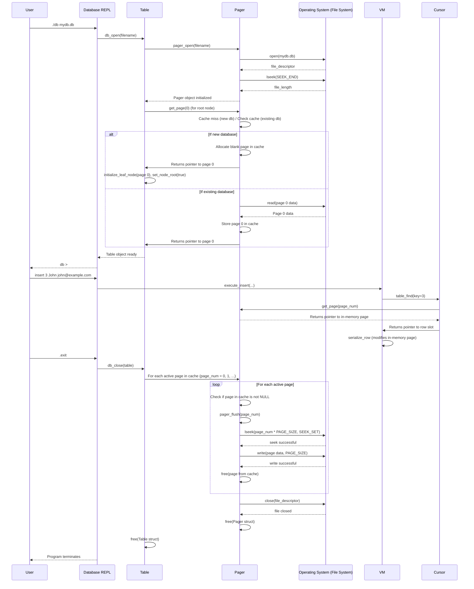

# Chapter 6: Pager

In our database journey so far, we've learned how to interact with our database using the [Chapter 1: REPL (Read-Execute-Print Loop)](01_repl__read_execute_print_loop__.md), how to organize our data into `Row`s and pack them into bytes using [Chapter 2: Row & Serialization](02_row___serialization_.md), and how the database understands your commands with its "brain" in [Chapter 3: Statement Processing (Compiler & Virtual Machine)](03_statement_processing__compiler___virtual_machine__.md). Most recently, we introduced the [Chapter 4: Cursor](04_cursor_.md) to navigate our data and the foundational [Chapter 5: B-Tree Node](05_b_tree_node_.md) which organizes data into a tree structure on fixed-size "pages."

But there's still one big problem: **Our database forgets everything when you close the program!** All the data you carefully `insert` disappears. This is because we've only been storing data in our computer's temporary memory (RAM). To make our database useful, we need to save the data permanently to a file on your hard drive.

This is exactly the problem the **Pager** solves!

## What Problem Does a Pager Solve?

The `Pager` is like the database's direct interface with the underlying file system. It's the component responsible for making sure your data is saved to disk and loaded back into memory efficiently.

Imagine your database has a massive book (the database file) that's too big to fit entirely in your brain (RAM). You only want to read a few pages at a time. The Pager helps by:

*   **Persistence**: Saving changes to the book (database file) so they're still there next time you open it.
*   **Efficient Access (Caching)**: Instead of reading individual words or sentences, the Pager reads and writes entire "pages" (fixed-size blocks of data, usually 4KB). It keeps a few recently read pages in a "cache" (a small, fast-access memory area). If you ask for a page that's already in the cache, it's super fast! If not, the Pager fetches it from the disk, which is slower but ensures you always get the data.
*   **Abstraction**: Hiding the messy details of file operations (like finding specific spots in a file) from other parts of the database. Components like the `B-Tree Node` and `Cursor` just ask the `Pager` for "page number X" and get the data back.

## Key Concepts of a Pager

Our `Pager` will be a `struct` that manages the connection to our database file and the in-memory cache of pages.

```c
// File: db.c
#define TABLE_MAX_PAGES 400 // We can hold up to 400 pages (400 * 4KB = 1.6MB)
const uint32_t PAGE_SIZE = 4096; // Each page is 4096 bytes (4KB)

typedef struct {
  int file_descriptor;       // Our connection to the database file
  uint32_t file_length;      // How big the database file is on disk
  uint32_t num_pages;        // How many pages are actually in the file
  void* pages[TABLE_MAX_PAGES]; // The in-memory cache (array of pointers to pages)
} Pager;
```

Here's how we'll use it:

### 1. `pager_open(const char* filename)`: Connecting to the File

This function is called when our database program starts. It opens the database file (creating it if it doesn't exist), finds out how big the file is, and sets up our `Pager` struct with an empty cache.

```c
// File: db.c
Pager* pager_open(const char* filename) {
  // open() is a system call to open a file.
  // O_RDWR: Read/Write mode. O_CREAT: Create if not exists.
  // S_IWUSR | S_IRUSR: Permissions (user can write and read)
  int fd = open(filename, O_RDWR | O_CREAT, S_IWUSR | S_IRUSR);

  if (fd == -1) { // Check for errors
    printf("Unable to open file\n");
    exit(EXIT_FAILURE);
  }

  // lseek() moves the file pointer. SEEK_END goes to end of file.
  // This helps us get the file's current size.
  off_t file_length = lseek(fd, 0, SEEK_END);

  Pager* pager = malloc(sizeof(Pager));
  pager->file_descriptor = fd;
  pager->file_length = file_length;
  // Calculate how many full pages are currently in the file
  pager->num_pages = (file_length / PAGE_SIZE);

  // Initialize the cache: all page pointers are NULL (empty)
  for (uint32_t i = 0; i < TABLE_MAX_PAGES; i++) {
    pager->pages[i] = NULL;
  }
  return pager;
}
```
This function is the very first step in connecting our in-memory database to a persistent file on disk.

### 2. `get_page(Pager* pager, uint32_t page_num)`: Fetching a Page

This is the central function of the `Pager`. When any part of our database (like the `Cursor` or `B-Tree Node` logic) needs a specific `page_num`, it calls `get_page`.

```c
// File: db.c
void* get_page(Pager* pager, uint32_t page_num) {
  // 1. Check if the page is already in our cache (a "cache hit")
  if (pager->pages[page_num] == NULL) {
    // 2. Cache miss: Page not in memory. Allocate space for it.
    void* page = malloc(PAGE_SIZE);
    // Calculate how many pages are currently saved in the file on disk
    uint32_t num_pages_on_disk = pager->file_length / PAGE_SIZE;

    // 3. If the requested page number is actually within the file's current size
    if (page_num < num_pages_on_disk) {
      // Read the page from disk into the allocated memory
      lseek(pager->file_descriptor, page_num * PAGE_SIZE, SEEK_SET); // Go to correct spot in file
      ssize_t bytes_read = read(pager->file_descriptor, page, PAGE_SIZE); // Read 4KB
      if (bytes_read == -1) { /* ... error handling ... */ }
    } else {
      // This is a new page, beyond the current end of the file.
      // We've already allocated a blank page of memory, which is what we want.
    }

    // 4. Store the page in our cache
    pager->pages[page_num] = page;

    // 5. Update the count of pages in our Pager if we've accessed a new highest page
    if (page_num >= pager->num_pages) {
      pager->num_pages = page_num + 1;
    }
  }
  // 6. Return the page from the cache
  return pager->pages[page_num];
}
```
This `get_page` function is crucial for performance. It avoids slow disk reads whenever possible by using the cache. When a page is requested, it either returns it immediately from RAM or loads it from disk if needed.

### 3. `pager_flush(Pager* pager, uint32_t page_num)`: Saving a Page to Disk

When we want to make sure a specific page's changes are saved, we call `pager_flush`. This takes the page data from memory and writes it back to the database file on disk.

```c
// File: db.c
void pager_flush(Pager* pager, uint32_t page_num) {
  // 1. Ensure the page we want to flush is actually in memory
  if (pager->pages[page_num] == NULL) {
    printf("Tried to flush null page\n"); // This should not happen
    exit(EXIT_FAILURE);
  }

  // 2. Go to the correct spot in the database file
  // page_num * PAGE_SIZE gives the byte offset for that page
  off_t offset = lseek(pager->file_descriptor, page_num * PAGE_SIZE, SEEK_SET);
  if (offset == -1) { /* ... error handling ... */ }

  // 3. Write the entire 4KB page from memory to the file
  ssize_t bytes_written =
      write(pager->file_descriptor, pager->pages[page_num], PAGE_SIZE);
  if (bytes_written == -1) { /* ... error handling ... */ }
}
```
This function is the inverse of `get_page`'s disk read: it writes the in-memory page back to its permanent home on disk.

### 4. `db_close(Table* table)`: Closing the Database

This function is called when the user wants to exit the database program (`.exit`). Its job is to ensure all changed pages are written to disk and then clean up all allocated memory and close the file.

```c
// File: db.c
void db_close(Table* table) {
  Pager* pager = table->pager;

  // Loop through all pages that were potentially touched/allocated
  for (uint32_t i = 0; i < pager->num_pages; i++) {
    // If a page is in the cache (not NULL), flush it to disk
    if (pager->pages[i] == NULL) {
      continue; // Skip empty cache slots
    }
    pager_flush(pager, i); // Write the page to disk
    free(pager->pages[i]); // Free the memory used by this page
    pager->pages[i] = NULL;
  }

  // Close the database file connection
  int result = close(pager->file_descriptor);
  if (result == -1) { /* ... error handling ... */ }

  // Free the Pager and Table structures themselves
  free(pager);
  free(table);
}
```
`db_close` is our "save all changes and shut down cleanly" function. It's vital for ensuring persistence.

## How Pager Solves Our Use Case

With the `Pager` in place, our database can now truly persist data!

1.  **Opening the Database (`db_open`)**:
    *   When you start the `db` program with a filename (e.g., `./db mydata.db`), our `main` function now calls `db_open`.
    *   `db_open` calls `pager_open`, which connects to `mydata.db`. If `mydata.db` is a new file, it will be empty. If it already exists, `pager_open` will read its length and calculate how many pages it contains.
    *   Crucially, if the file is new and empty, `db_open` ensures that page 0 is immediately initialized as our root `B-Tree Node` ([Chapter 5: B-Tree Node](05_b_tree_node_.md)) and stored in the `Pager`'s cache.

2.  **Accessing/Modifying Data (`insert`, `select`)**:
    *   When `execute_insert` or `execute_select` (from [Chapter 3: Statement Processing (Compiler & Virtual Machine)](03_statement_processing__compiler___virtual_machine__.md)) needs to interact with data, they use the `Cursor` ([Chapter 4: Cursor](04_cursor_.md)).
    *   The `Cursor` then calls `get_page(table->pager, page_num)` to retrieve the necessary `B-Tree Node` page from the `Pager`.
    *   The `Pager` handles whether that page needs to be read from disk or is already in memory. Once the page is in memory, the `Cursor` and `B-Tree Node` logic can modify or read the serialized `Row`s on it. Any changes are made directly to the in-memory copy of the page.

3.  **Saving Changes (`.exit`)**:
    *   When you type `.exit`, our `do_meta_command` now calls `db_close(table)`.
    *   `db_close` iterates through all pages that might have been loaded into the `Pager`'s cache. For each of these pages, it calls `pager_flush` to write the in-memory content back to the `mydata.db` file.
    *   Finally, it frees all allocated memory and closes the file.

This means if you `insert` some data, then `.exit`, and then run `./db mydata.db` again and `select`, your data will still be there!

```shell
# First run: Insert data
db > insert 1 user1 person1@example.com
Executed.
db > insert 2 user2 person2@example.com
Executed.
db > .exit
db >

# Second run: Select data, it's still there!
db > select
(1, user1, person1@example.com)
(2, user2, person2@example.com)
Executed.
db > .exit
db >
```

## Internal Implementation Walkthrough

Let's trace how the `Pager` orchestrates data persistence, particularly during opening and closing the database.



### Changes in `main` and `Table` Initialization

The `main` function now takes a command-line argument for the database filename and passes it to `db_open`. Also, the `Table` struct no longer manages the `pages` array directly; it delegates that responsibility to the `Pager`.

```c
// File: db.c
// ... (includes, InputBuffer, etc.) ...

// The Pager struct (as defined above)
// The Table struct now holds a Pager* instead of a pages array
typedef struct {
  Pager* pager;
  uint32_t root_page_num; // Points to the page number of the B-Tree root
} Table;

// ... (other structs and constants) ...

int main(int argc, char* argv[]) {
  if (argc < 2) { // Check if filename was provided
    printf("Must supply a database filename.\n");
    exit(EXIT_FAILURE);
  }

  char* filename = argv[1]; // Get filename from arguments
  Table* table = db_open(filename); // Open the database!

  InputBuffer* input_buffer = new_input_buffer();
  while (true) {
    print_prompt();
    read_input(input_buffer);

    if (input_buffer->buffer[0] == '.') {
      // Pass 'table' to do_meta_command so it can call db_close on .exit
      switch (do_meta_command(input_buffer, table)) {
        case (META_COMMAND_SUCCESS):
          continue;
        case (META_COMMAND_UNRECOGNIZED_COMMAND):
          printf("Unrecognized command '%s'\n", input_buffer->buffer);
          continue;
      }
    }
    // ... (rest of main loop for prepare_statement and execute_statement) ...
  }
}
```
The `main` function is now responsible for setting up our database connection by calling `db_open` with a specific filename. This filename tells the `Pager` where to store our data persistently.

### Database Open (`db_open`)

The `db_open` function is how we initialize our `Table` and `Pager` relationship.

```c
// File: db.c
Table* db_open(const char* filename) {
  Pager* pager = pager_open(filename); // First, create and open the Pager

  Table* table = malloc(sizeof(Table));
  table->pager = pager; // Link the Pager to the Table
  table->root_page_num = 0; // Page 0 is always our root B-Tree node

  // If the file was empty (new database), initialize page 0 as a leaf node.
  // This is the first B-Tree node our database will ever have.
  if (pager->num_pages == 0) {
    void* root_node = get_page(pager, 0); // Request page 0 from the Pager
    initialize_leaf_node(root_node);      // Set it up as an empty leaf node
    set_node_root(root_node, true);       // Mark it as the root of the B-tree
  }
  return table;
}
```
This function is crucial for starting our database. It ensures that if you start with a new database file, it has a proper root node ready to store data. If you open an existing file, the `Pager` is ready to load its pages.

### Accessing Pages

Functions that previously accessed `table->pages` directly now call `get_page` on the `table->pager`. For example, `cursor_value` gets the page through the Pager:

```c
// File: db.c (part of cursor_value)
void* cursor_value(Cursor* cursor) {
  uint32_t page_num = cursor->page_num;
  // Request the page from the pager!
  void* page = get_page(cursor->table->pager, page_num);
  // Then calculate the exact spot within that page for the row's value
  return leaf_node_value(page, cursor->cell_num);
}
```
This shows how other parts of the database now *rely* on the `Pager` to provide the raw memory for pages. They don't care *how* the `Pager` gets the page (from cache or disk), just that they get it.

### Closing the Database (and saving data!)

The `.exit` meta-command now calls `db_close` which properly flushes data to disk.

```c
// File: db.c (part of do_meta_command)
MetaCommandResult do_meta_command(InputBuffer* input_buffer, Table* table) {
  if (strcmp(input_buffer->buffer, ".exit") == 0) {
    close_input_buffer(input_buffer);
    db_close(table); // <<< This is the important call!
    exit(EXIT_SUCCESS);
  }
  // ... (other meta-commands) ...
}
```
This simple change ensures that all your hard-earned data is safely written to the file before the program shuts down.

## Conclusion

In this chapter, we introduced the **Pager** – the vital component that connects our in-memory database to the persistent file system. You've learned how it manages fixed-size data blocks called "pages," uses a cache to speed up access, and ensures data is saved to disk and loaded efficiently. This finally makes our database remember your data across program restarts!

With persistence handled, our database can now store truly large amounts of data in a file. The `Pager` provides the foundation for managing these pages, allowing the `B-Tree Node` structure to organize them effectively.