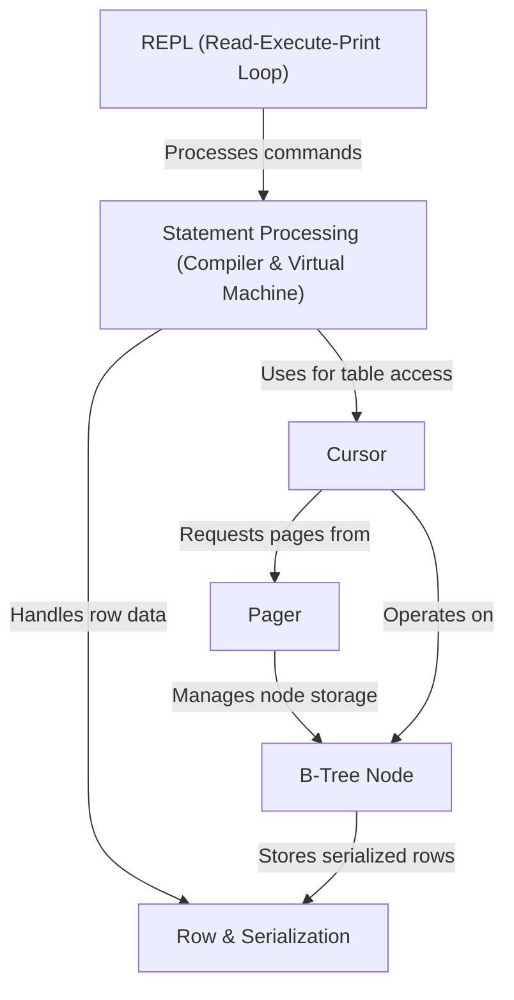

# Tutorial: db_tutorial

This project demonstrates how to build a simple, *file-based* database, much like SQLite.
It guides you through creating an **interactive command-line interface** (REPL),
processing your commands, and storing your data persistently on disk using a
specialized data structure called a **B-tree**.

## Visual Overview

## Chapters

1. [REPL (Read-Execute-Print Loop)
](01_repl__read_execute_print_loop__.md)
2. [Row & Serialization
](02_row___serialization_.md)
3. [Statement Processing (Compiler & Virtual Machine)
](03_statement_processing__compiler___virtual_machine__.md)
4. [Cursor
](04_cursor_.md)
5. [B-Tree Node
](05_b_tree_node_.md)
6. [Pager
](06_pager_.md)
